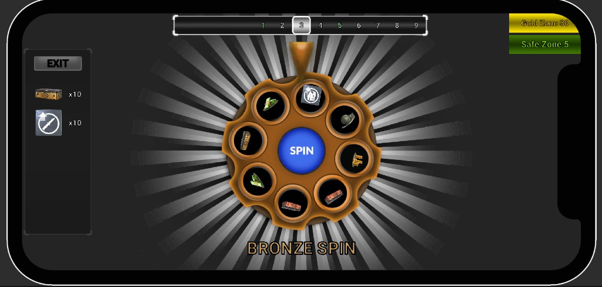
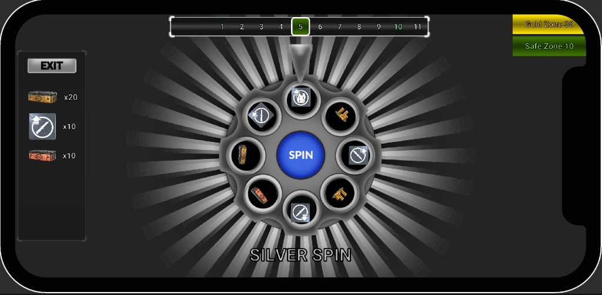

# VertigoGames Case Study

Unity tabanlı bir **şans çarkı (wheel)** mini oyunu. Seviye ilerlemesi, ödül seçimi, kaybetme / revive akışı ve tema değişimleri `WheelEvents` ile gevşek bağlı bileşenler üzerinden yönetilir.

## Gereksinimler

| Bileşen | Sürüm |
|--------|--------|
| **Unity Editor** | **2021.3.45f2** (LTS) — `ProjectSettings/ProjectVersion.txt` ile uyumlu olmalıdır |

Önerilen IDE paketleri: Visual Studio, Rider veya VS Code (`Packages/manifest.json` içinde ilgili IDE paketleri tanımlıdır).

## Projeyi Açma ve Çalıştırma

1. Unity Hub üzerinden **Add** ile bu depoyu ekleyin ve proje klasörü olarak **`VertigoGames_CaseStudy`** dizinini seçin.
2. Projeyi listeden açın; ilk açılışta paketler ve asset veritabanı yeniden içe aktarılabilir (birkaç dakika sürebilir).
3. Ana sahne: **`Assets/Scenes/Game.unity`** — Editörde çift tıklayıp açın ve **Play** ile çalıştırın.

## Depo İçeriği (kök dizin)

| Öğe | Açıklama |
|-----|----------|
| `VertigoGames_CaseStudy/` | Unity proje kökü |
| `case_study_v2.apk` | Örnek Android derlemesi |
| `gameplay_video.mp4` | Oynanış kaydı |
| `16_9.png`, `20_9.png`, `4_3.png` | Görsel / referans veya mağaza görselleri |

## Mimari Özet

- **Olay tabanlı iletişim:** `WheelEvents` statik sınıfı spin, ödül, seviye, bomba, kaybetme paneli, reklam ve çıkış akışlarını `Action` delegeleriyle yayınlar.
- **Çark ve seviye:** `WheelController` scriptable seviye veritabanından (`WheelLevelDataBase`) seviyeyi kurar; dilim seçimi **rastgele** (ağırlıklı veya düz) veya **sabit** dilim olabilir.
- **Animasyon:** Çark dönüşü ve idle animasyonu **DOTween** (`DG.Tweening`) ile yapılır (`Assets/Plugins/Demigiant/DOTween`).
- **Kalıcılık:** İlerleme ve bazı ayarlar **PlayerPrefs** ile saklanır (ör. `CurrentLevelIndex`, `TotalLevels`).
- **UI:** TextMesh Pro ve Unity **uGUI** kullanılır.

## `Assets/Scripts` Klasör Yapısı

| Klasör | Rol |
|--------|-----|
| `Wheel/` | Çark kontrolü, dilim verisi, dönüş (`WheelRotateController`), tema, oyun sonu paneli, gösterge |
| `Button/` | Spin, güvenli altın bölgesi, genel UI butonları |
| `Level/` | Seviye şeridi (`LevelTrackController`), arka plan kaydırma |
| `Reward/` | Ödül yönetimi, onay / çıkış panelleri, pop efektleri |
| `LosePanel/` | Kaybetme, reklam ve revive akışı |
| `Sound/` | Ses yönetimi |
| `Tween/` | Yardımcı tween bileşenleri |

Veri tarafında **`Assets/ScriptableObjects`** altında seviye ve dilim asset’leri bulunur.

## Kullanılan Paketler (özet)

Unity Package Manager üzerinden: **TextMesh Pro**, **Timeline**, **uGUI**, **Visual Scripting**, **Test Framework**, **2D Sprite** ve çeşitli yerleşik modüller. Üçüncü parti olarak projede **DOTween** (Demigiant) plugin olarak eklenmiştir.

## Android Derlemesi

1. **File → Build Settings** → Platform olarak **Android** seçin; gerekirse modül kurulumunu tamamlayın.
2. **Player Settings** içinden paket adı, imzalama ve minimum API seviyesini projenize göre ayarlayın.
3. `Game` sahnesini build listesine ekleyin ve **Build** / **Build And Run** kullanın.

Örnek çıktı için kökteki `case_study_v2.apk` dosyasına bakabilirsiniz.

## Lisans ve Üçüncü Parti Notları

Unity ve kullanılan asset/plugin’lerin lisansları ilgili klasörlerdeki metin dosyalarına ve Unity EULA’ya tabidir. Ticari kullanımdan önce DOTween ve TextMesh Pro örnek içeriklerinin lisans koşullarını kontrol edin.

---

*Bu README, `VertigoGames_CaseStudy` Unity projesinin mevcut yapılandırmasına göre hazırlanmıştır.*

## Ekran görüntüleri

**Bronze Spin** — revolver silindir temalı çark, seviye şeridi, Gold / Safe zone ve ödül paneli.

**Silver Spin** — aynı mekaniğin farklı tema ve seviye ilerlemesiyle görünümü.

